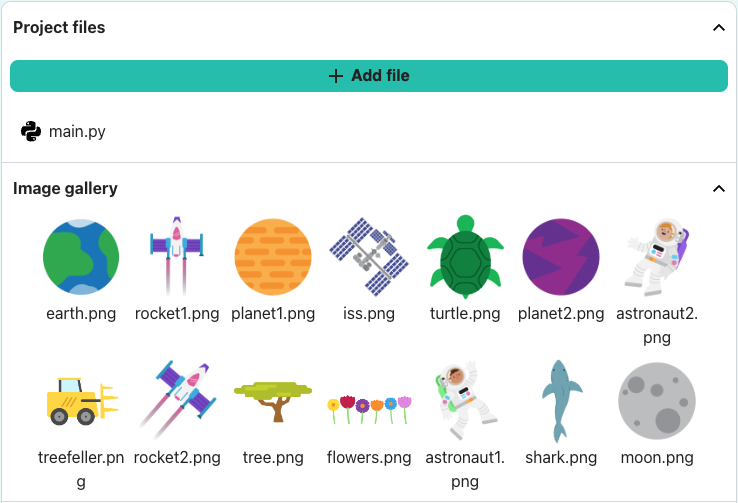
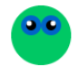

## Set the theme

<div style="display: flex; flex-wrap: wrap">
<div style="flex-basis: 200px; flex-grow: 1; margin-right: 15px;">
Set the theme of your game and create a player character that follows the mouse pointer.

</div>
<div>

{:width="300px"}

</div>
</div>

What is the theme of your game? Here are some ideas:
- Sports
- Hobbies
- Science
- Nature

--- task ---

Open the [Don't Collide! starter project](https://editor.raspberrypi.org/en/projects/dont-collide-starter){:target="_blank"} project. The code editor will open in another browser tab.

If you have a Raspberry Pi account, you can click on the **Save** button to save a copy to your **Projects**.
>>>>>>> Stashed changes

--- /task ---

--- task ---

**Choose:** Set the size of your canvas.

--- code ---
---
language: python
filename: main.py - setup()
line_numbers: true
line_number_start: 9
line_highlights: 10
---

def setup():
    size(400, 400)

--- /code ---

--- /task ---

--- task ---

Create a variable called `safe` to store the background colour based on the theme you want for your game. 

This is the colour that it is safe for the player to be on and you will use this variable again later.

--- code ---
---
language: python
filename: main.py - draw()
line_numbers: true
line_number_start: 13
line_highlights: 14, 15, 16
---

def draw():
    global safe
    safe = Color(200, 100, 0)  # Add the colour of your theme
    background(safe)

--- /code ---

[[[generic-theory-simple-colours]]]

--- /task ---

--- task ---

**Test:** Run your code to see the background colour. Change it until you are happy with the colour and the size of the screen.

--- /task ---

Now choose the character that is playing the game and avoiding the obstacles. Is it an object, person, animal, or something else?

The player will appear at a fixed `y` position and same `x` position as the mouse pointer, which is stored in the `p5` variable `mouse_x`. 

--- task ---

It's a good idea to organise the code for drawing the player character into a function.

Define a `draw_player()` function and create a `player_y` position for the fixed `y` position of the player: 

--- code ---
---
language: python
filename: main.py - draw_player()
line_numbers: true
line_number_start: 12
line_highlights: 12-14
---

def draw_player():
    player_y = int(height * 0.8)  # Positioned towards the screen bottom

--- /code ---

Add code to `draw()` to call `draw_player()` each frame.

--- code ---
---
language: python
filename: main.py - draw()
line_numbers: true
line_number_start: 15
line_highlights: 19
---

def draw():
    global safe
    safe = Color(200, 100, 0)  # Your chosen colour
    background(safe)
    draw_player()
  
--- /code ---

--- /task ---

Next you will add code to the `draw_player()` function to draw your shape. You may also need to add `setup()` code.

--- task ---

**Choose:** What does your player look like? Your player could be:
+ An image provided in the starter project
+ An emoji 🎈 or text
+ Drawn using a series of shapes 

--- collapse ---
---
title: Use a starter image
---

Images included in the starter project will be shown in the `Image gallery`.



Make a note of the name of the image you want to use.

Load the image into the `setup()` function 

--- code ---
---
language: python
filename: main.py - setup()
line_numbers: true
line_number_start: 9
line_highlights: 11-12
---

def setup():
    size(400, 400)
    global player
    player = load_image('turtle.png')  # Load your image

--- /code ---

Call the `image()` and set it as global in the `draw_player()` function.

--- code ---
---
language: python
filename: main.py - draw_player()
line_numbers: true
line_number_start: 14
line_highlights: 16
---

def draw_player():
    player_y = int(height * 0.8)  # Positioned towards the screen bottom
    image(player, mouse_x, player_y, 30, 30)

--- /code ---

--- /collapse ---

--- collapse ---
---
title: Use emoji characters
---

You can use emoji characters in the p5 `text()` function to use an emoji to represent your player. 

Here's an example:

--- code ---
---
language: python
filename: main.py - setup()
line_numbers: true
line_number_start: 9
line_highlights: 11-13
---

def setup():
    size(400, 400)
    text_size(40)  # Controls the size of the emoji
    text_align(CENTER, TOP)  # Position around the centre

--- /code ---

Call the `text()` and set it as global in the `draw_player()` function.

--- code ---
---
language: python
filename: main.py - draw_player()
line_numbers: true
line_number_start: 14
line_highlights: 16-17
---

def draw_player():
    player_y = int(height * 0.8)
    text('🎈', mouse_x, player_y)

--- /code ---

--- /collapse ---

[[[processing-python-text]]]

[[[generic-theory-simple-colours]]]

[[[processing-python-ellipse]]]

[[[processing-python-rect]]]

[[[processing-python-triangle]]]

[[[processing-tint]]]

[[[processing-stroke]]]

**Tip:** You can use several simple shapes in the same function to create a more complex player.

--- collapse ---
---
title: Draw a player using multiple shapes
---



--- code ---
---
language: python
filename: main.py - draw_player()
---

def draw_player():
    player_y = int(height * 0.8)
    noStroke()
    # Face
    fill(0, 200, 100)
    ellipse(mouse_x, player_y, 60, 60)
    
    # Eyes
    fill(0, 100, 200)
    ellipse(mouse_x - 10, player_y - 10, 20, 20)
    ellipse(mouse_x + 10, player_y - 10, 20, 20)
    fill(0)
    ellipse(mouse_x - 10, player_y - 10, 10, 10)
    ellipse(mouse_x + 10, player_y - 10, 10, 10)
    fill(255)
    ellipse(mouse_x - 12, player_y - 12, 5, 5)
    ellipse(mouse_x + 12, player_y - 12, 5, 5)

--- /code ---

--- /collapse ---

--- /task ---

--- task ---

**Test:** Run your code and move the mouse to control the player.

Does it move like you expect?

--- /task ---

**Debug:** You might find some bugs in your project that you need to fix. Here are some common bugs.

--- task ---

--- collapse ---
---
title: I can't see the player
---

Try switching to full screen. Also, check the `x` and `y` coordinates that you used to draw the player — make sure they are inside the canvas you created with `size()`.

--- /collapse ---

--- collapse ---
---
title: An image isn't loading
---

First, check that the image is in the `Image gallery`. Then, check the filename really carefully — remember capital letters are different to lower case letters and punctuation is important.

--- /collapse ---

--- collapse ---
---
title: An image is the wrong size
---

Check the inputs that control the width and height of the image:

```python
image(image_file, x_coord, y_coord, width, height)
```

--- /collapse ---

--- collapse ---
---
title: An emoji is the wrong size
---

If your emoji is too big or too small, change the value in `text_size()`.

--- /collapse ---

--- /task ---

--- save ---

## Create obstacles

<div style="display: flex; flex-wrap: wrap">
<div style="flex-basis: 200px; flex-grow: 1; margin-right: 15px;">
Create the obstacles that you will have to avoid to keep playing the game.
</div>
<div>

{:width="300px"}

</div>
</div>

### Start with one obstacle

You can make obstacles in the same ways that you made your player. How do the obstacles fit with your theme? 

You are going to use a `for` loop to make lots of copies so you only need to make or choose one obstacle.

--- task ---

Define a `draw_obstacles()` function:

--- code ---
---
language: python
filename: main.py - draw_obstacles()
line_numbers: false
line_number_start:
line_highlights: 4
---

def draw_obstacles():
    ob_x = width/2
    ob_y = height/2
    text('🌵', ob_x, ob_y)  # Replace with your obstacle
  
--- /code ---

Add code to `draw()` to call `draw_obstacles()` each frame.

--- code ---
---
language: python
filename: main.py - draw()
line_numbers: false
line_number_start:
line_highlights: 5
---

def draw():
    global safe
    safe = Color(200, 100, 0)  # Add the colour of your theme
    background(safe)
    draw_obstacles()  # Before drawing the player
    draw_player()
  
--- /code ---

--- /task ---

--- task ---

**Choose:** What does your obstacle look like? Your obstacle could be:
+ An image provided in the starter project
+ An emoji 🌵 or text
+ Drawn using a series of shapes 

--- collapse ---
---
title: Use a starter image
---

Images included in the starter project will be shown in the `Image gallery`.


Make a note of the name of the image you want to use.

Load the image into the `setup()` function 

--- code ---
---
language: python
filename: main.py - setup()
line_numbers: true
line_number_start: 9
line_highlights: 12
---

def setup():
    size(400, 400)
    global player
    player = load_image('turtle.png')  # Load your player image
    obstacle = load_image('shark.png')  # Load your obstacle image

--- /code ---

Find the line `# Keep this to run your code`. Before that line, define a new `draw_obstacles()` function, call `obstacle` as a global variable and use it in the call to `image()`.

--- code ---
---
language: python
filename: main.py - draw_obstacles()
---

def draw_obstacles():
    ob_x = width/2
    ob_y = height/2
    
    global obstacle
    
    image(obstacle, ob_x, ob_y, 30, 30)  # Resize to fit your theme

--- /code ---

--- /collapse ---

--- collapse ---
---
title: Use emoji characters
---

You can use emoji characters in the p5 `text()` function to represent your obstacles. 

Here's an example:

--- code ---
---
language: python
filename: main.py - setup()
---

def setup():
    size(400, 400)
    text_size(40)  # Controls the size of the emoji 
    text_align(CENTER, TOP)  # Position around the centre

--- /code ---

Find the line `# Keep this to run your code`. Before that line, define a new `draw_obstacles()` function.

--- code ---
---
language: python
filename: main.py - draw_obstacles()
---

def draw_obstacles():
    ob_x = width/2
    ob_y = height/2
    text('🌵', ob_x, ob_y)

--- /code ---

--- /collapse ---

[[[processing-python-text]]]

[[[generic-theory-simple-colours]]]

[[[processing-python-ellipse]]]

[[[processing-python-rect]]]

[[[processing-python-triangle]]]

[[[processing-tint]]]

[[[processing-stroke]]]

**Tip:** You can use several simple shapes in the same function to create a more complex obstacle.

--- collapse ---
---
title: Draw an obstacle using multiple shapes
---


--- code ---
---
language: python
filename: main.py - draw_obstacles()
---

def draw_obstacles():
    ob_x = width/2
    ob_y = height/2
    # Draw a fir tree
    no_stroke()
    fill(0,255,0)  # Green for needles
    triangle(ob_x + 20, ob_y + 20, ob_x + 10, ob_y + 40, ob_x + 30, ob_y + 40)
    triangle(ob_x + 20, ob_y + 30, ob_x + 5, ob_y + 55, ob_x + 35, ob_y + 55)
    triangle(ob_x + 20, ob_y + 40, ob_x + 0, ob_y + 70, ob_x + 40, ob_y + 70)
    fill(150,100,100)  # Brown for trunk
    rect(ob_x + 15, ob_y + 70, 10, 10)

--- /code ---

--- /collapse ---

--- /task ---

### Get your obstacle moving

--- task ---

Now add code to increase the `y` position of the obstacle each frame, and have it wrap around when it gets to the bottom to create the effect of another obstacle. 

The p5 `frame_count` variable starts counting the frames when you click run. 

`ob_y %= height` sets the `y` position to the remainder when divided by `height`. With a `height` of '400', this will turn `401` into `1` so when the obstacles goes off the bottom of the screen, it reappears at the top.

--- code ---
---
language: python
filename: main.py - draw_obstacles()
---

def draw_obstacles():
    ob_x = width/2
    ob_y = height/2 + frame_count  # Increases each frame
    ob_y %= height  # Wrap around
    text('🌵', ob_x, ob_y)  # Replace with your obstacle

--- /code ---

--- /task ---

### Lots of obstacles

You could draw lots of copies of your obstacle at different starting locations but that's quite a lot of work. Let's use a shortcut.

<p style="border-left: solid; border-width:10px; border-color: #0faeb0; background-color: aliceblue; padding: 10px;"> 
<span style="color: #0faeb0">**Procedural generation**</span> is used in the creation of game worlds, obstacles, and movie scenes to create randomness but with certain rules applied. A <span style="color: #0faeb0">seed</span> means you can generate the same results every time you use the same seed.</p>

--- task ---

This code uses a `for` loop with `randint()` to choose obstacle positions for you. Calling the random `seed()` function first means that you will always get the same random numbers. This means that the obstacles won't jump around every frame and you can change the seed until you get one that positions the obstacles fairly.

--- code ---
---
language: python
filename: main.py - draw_obstacles()
---

def draw_obstacles():
    seed(12345678)  # Any number is fine
  
    for i in range(6):  
        ob_x = randint(0, height)
        ob_y = randint(0, height) + frame_count
        ob_y %= height
        text('🌵', ob_x, ob_y)  # Replace with your obstacle

--- /code ---

Useful information:

[[[using-seed-in-python]]]

[[[generic-python-for-loop-repeat]]]

--- /task ---

--- collapse ---
---
title: Epilepsy warning
---

Testing your program has the potential to induce seizures for people with photosensitive epilepsy. If you have photosensitive epilepsy or feel you may be susceptible to a seizure, do not run your program. Instead, you can:
- Make sure you have added the `seed()` line of code to make sure your obstacles don't jump around
- Ask somebody to run it for you
- Move on and complete the project, asking someone to run the project for you at the end so you can debug
- Slow the game down by using `frame_rate = 10` in your call to `run()` like this:

```python
run(frame_rate = 10)
```
You can alter the speed of the game by changing `10` to a higher or lower value.

--- /collapse ---

--- task ---

**Test:** Run your program and you should see multiple objects on the screen, wrapping around when they get to the bottom. 

Change your code until you are happy with the obstacles you have. You can:

+ Change the seed to get obstacles in different starting positions
+ Change the number of times to loop repeats to get a different number of obstacles
+ Adjust the size of the obstacles

**Tip:** Make sure it is possible to avoid your obstacles but that there is no easy path through your game.

--- /task ---

--- task ---

**Debug:** You might find some bugs in your project that you need to fix. Here are some common bugs.

--- collapse ---
---
title: Only one obstacle is being drawn
---

Check your function that draws multiple obstacles:
 + Make sure it uses a `for` loop to call the obstacle drawing function more than once
 + Make sure it uses `randint()` to change the (x, y) coordinates it is passing to the obstacle drawing function
 + Check that you have used `ob_x` and `ob_y` as the coordinates for your obstacle

For example:

--- code ---
---
language: python
filename: main.py — draw_obstacles()
---

def draw_obstacles():
    seed(12345678)
    
    for i in range(6):  
        ob_x = randint(0, height)
        ob_y = randint(0, height) + frame_count
        ob_y %= height
        text('🌵', ob_x, ob_y)  # Replace with your obstacle

--- /code ---

--- /collapse ---

--- collapse ---
---
title: The obstacles are changing position every time a frame is drawn
---

Make sure that you have used `seed()` inside the function that draws multiple obstacles.

--- /collapse ---

--- /task ---

<p style="border-left: solid; border-width:10px; border-color: #0faeb0; background-color: aliceblue; padding: 10px;"> 
Programmers use lots of neat tricks like using the `%` operator to make objects wrap around the screen and the `seed()` function to generate the same random numbers. The more coding you do, the more neat tricks you will learn.</p>

--- save ---
## Collision detection

<div style="display: flex; flex-wrap: wrap">
<div style="flex-basis: 200px; flex-grow: 1; margin-right: 15px;">
Endless runner games often end when the player collides with an obstacle.
</div>
<div>

{:width="300px"}

</div>
</div>

Now you can set up your player to react to an obstacle collision.

<p style="border-left: solid; border-width:10px; border-color: #0faeb0; background-color: aliceblue; padding: 10px;">
<span style="color: #0faeb0">**Collision detection**</span> is determining when two objects created inside a computer simulation — whether that's a game, and animation, or something else — are touching. There are several ways to do this, for example: 
  - checking if the colours appearing at the location of an object are the colours of that object, or a different one
  - keeping track of the shape of every object, and checking if those shapes overlap
  - creating a set of boundary points, or lines, around an object and checking if they come into contact with any other 'collidable' objects
When such a collision is detected, the program can react in some way. In a video game, this is usually to deal damage (if the player collides with an enemy or hazard) or to give a benefit (if the player collides with a power up).
</p>


--- task ---

In your `draw_player()` function, create a variable called `collide` and set it to get the hexadecimal (hex) colour value at the position of the player.

--- code ---
---
language: python
filename: main.py - draw_player()
---

    collide = get(mouse_x, player_y).hex

--- /code ---

--- /task ---

--- task ---

Create a condition to check `if` the `collide` variable is the same as the `safe` variable — if it is, then your player is safely touching the background and has not collided with an obstacle.

Move your code to draw your player inside your `if collide == safe` condition and add code in the `else` statement to get the player to react to the collision. 

**Choose:** How should your player react? You could:
+ Use a different emoji for the player
+ You could use `tint()` to change the appearance of an image, don't forget to call `no_tint()` after drawing the image

--- collapse ---
---
title: Use emoji characters
---

You can use emoji characters in the p5 `text()` function to represent your collided player. 

Here's an example:

--- code ---
---
language: python
filename: main.py - setup()
---

def setup():
    size(400, 400)
    text_size(40)  # Controls the size of the emoji 
    text_align(CENTER, TOP)  # Position around the centre

--- /code ---

--- code ---
---
language: python
filename: main.py - draw_player()
---

def draw_player():
    if collide == safe.hex:  # On background
        text('🎈', mouse_x, player_y)
    else:  # Collided
        text('💥', mouse_x, player_y)

--- /code ---

--- /collapse ---

[[[processing-tint]]]

[[[generic-theory-simple-colours]]]

--- /task ---

--- task ---

**Test:** Check if a collision is detected and the reaction takes place each time a collision occurs.

--- /task ---

--- task ---

**Debug:** You might find some bugs in your project that you need to fix. Here are some common bugs.

--- collapse ---
---
title: There is no collision when the player reaches an obstacle
---

If your player character touches the obstacle and nothing happens, there are a few things you should check:

 - Make sure you call `draw_obstacles()` before `draw_player()`. If you check for collisions before drawing the obstacles in a frame, then there won't be any obstacles to collide with!
 - Make sure you are using the exact same colour when drawing the object and in the `if` statement checking for the collision. You can make sure of this by using the same `global` variable in both places.
 - Are you drawing the player character before checking the colour at the mouse coordinates? If so, you are only ever going to get the colours from the player. You need to check the colour first and **then** draw the player.
 - Do you have code in the `else` part to do something different when a collision is detected, such as applying a tint or using an emoji?
 - Have you correctly indented the code for your `if` statement so it runs when the condition is met?

Printing the colour of the pixel you are checking for a collision can be useful:

```python
    print(red(collide), green(collide), blue(collide))
```

You can also print a circle around the point you are checking and adjust the point you check if you need to:

```python
    no_fill()
    ellipse(mouse_x, player_y, 10, 10)  # Draw collision point
```

--- /collapse ---

--- /task ---

--- task ---

**Optional:** At the moment, you are just detecting collisions at one pixel on your player. You could also detect collisions at other pixels at the edge of your player, such as the bottom or left- and right-most edges. 

--- collapse ---
---
title: Collision detection with multiple pixels
---

```python
def draw_player():
    
    player_y = int(height * 0.8)
    # Useful for debugging
    # Draw circles around the pixels to check for collisions
    
    no_fill()
    ellipse(mouse_x, player_y, 10, 10)  # Draw collision point
    ellipse(mouse_x, player_y + 40, 10, 10)
    ellipse(mouse_x - 12, player_y + 20, 10, 10)
    ellipse(mouse_x + 12, player_y + 20, 10, 10)

    collide = get(mouse_x, player_y).hex
    collide2 = get(mouse_x - 12, player_y + 20).hex
    collide3 = get(mouse_x + 12, player_y + 20).hex
    collide4 = get(mouse_x, player_y + 40).hex
    
    if mouse_x < width:  # Off the left of the screen
        collide2 = safe.hex
    
    if mouse_x > width:  # Off the right of the screen
        collide3 = safe.hex
        
    if collide == safe.hex and collide2 == safe.hex and collide3 == safe.hex and collide4 == safe.hex:
        text('🎈', mouse_x, player_y)
    else:
        text('💥', mouse_x, player_y)
```

--- /collapse ---

You could even use a loop and check lots of different pixels. This is how collision detection works in games. 

--- /task ---

--- save ---
## Speed up!

<div style="display: flex; flex-wrap: wrap">
<div style="flex-basis: 200px; flex-grow: 1; margin-right: 15px;">
Most endless runner games increase the difficulty of the game as the player progresses, and give them a score.
</div>
<div>

{:width="300px"}

</div>
</div>

### Add difficulty levels

Creating clear difficulty levels will make it easier for your player to understand what is happening.

--- task ---

Create a `global` `level` variable to track the level the player is currently on. Set it to `1` so players start a new game on the first level.

--- code ---
---
language: python
filename: main.py
line_numbers: true
line_number_start: 6
line_highlights: 7
---

# Include global variables here
level = 1

--- /code ---

--- /task ---

--- task ---

This code uses the `height` and the `frame_count` to increase the `level` variable every time the player finishes a screen, then prints out the new level for the player.

**Choose:** This code limits the levels to five, so it doesn't get too hard to play. There's no reason your game has to use five, but you should choose a limit. Humans can only move so fast!

--- code ---
---
language: python
filename: main.py — draw_obstacles()
---

def draw_obstacles():
    global level  # Use the global level
    
    if frame_count % height == height - 1 and level < 5:
        level += 1
        print('You have reached level', level)

--- /code ---

--- /task ---

--- task ---

The two main options for increasing difficulty are to make the game move faster, and to increase the number of obstacles.

--- collapse ---
---
title: Speed your game up
---

The speed of the game is controlled by how fast obstacles seem to be moving towards the player. This code speeds this up by adding `frame_count * level` to the `y` coordinate during obstacle generation. 

Instead of moving your obstacles by one pixel in every frame, this code effectively moves it by `level` pixels instead. 

Looking at the code, you might expect the speed to increase by more than `level` pixels. 
For example, at the point just before your `level` increases, the `frame_count` is `799` — as the `level` increases one frame before the `frame_count` is an even multiple of `height` (set at `400` pixels) — and `799 * 3` is notably bigger than `799 * 2`. However, the extra pixels created by multiplying the whole of `frame_count` by a bigger number are hidden by `ob_y %= height`. This leaves only the `level` extra pixels in each step.

--- code ---
---
language: python
filename: main.py — draw_obstacles()
line_numbers: false
---

    for i in range(6):
        ob_x = randint(0, height)
        ob_y = randint(0, height) + (frame_count * level)
        ob_y %= height  # Wrap around
        text('🌵', ob_x, ob_y)

--- /code ---

--- /collapse ---

--- collapse ---
---
title: Add more obstacles
---

Adding extra obstacles is just a matter of increasing the number of times the `for` loop that creates them runs. You can do this by increasing the number you pass to the `range()` function by `level`.

**Tip:** Of course, you can always use `level * 2`, or even larger multiples, if you want to make your game harder.

--- /collapse ---

--- /task ---

### Keep score

The longer a player lasts without colliding with an obstacle, the better they're playing your game. Adding a score will let them see how well they're doing.

--- task ---

Create a global `score` variable to track the player's score. Set it to `0` so players start a new game without any points.

--- code ---
---
language: python
filename: main.py
line_numbers: false
---

# Include global variables here
score = 0

--- /code ---

--- /task ---

--- task ---

You can increase your player's score for every frame where they have not collided with an obstacle by increasing their score when you check for collision in `draw_player()`.

**Choose:** You can decide how many points each frame is worth, but increasing the player's score by `level` rewards players who can survive at higher difficulty levels.

--- code ---
---
language: python
filename: main.py — draw_player()
---

    global score

    if collide == safe.hex:
        text('🎈', mouse_x, player_y)
        score += level
    else:
        text('💥', mouse_x, player_y)

--- /code ---

--- /task ---

--- task ---

Players should be able to see their score. Because it increases so quickly, using `print()` wouldn't work very well. Use the p5 `text()` function inside your `draw()` function, to display it as text on the game screen instead.

[[[processing-python-text]]]

You can use the `+` operator to combine two or more strings if you want to give a heading like 'score' or 'points'. Because `score` is a number, you will need to convert it to a string before you can join it with another string. You can do this with `str()`:

```python
message = 'Score: ' + str(score)
```
**Tip:** `str()` is short for 'string' — programmers often remove letters like this, so they don't have to type as much!

--- /task ---

### Game over!

When a player has collided with an obstacle, the game should stop moving and their score should stop increasing.

--- task ---

You can use the `level` variable to signal 'Game over' by setting it to 0 — a value it will never reach any other way. Do this in the `else` step of your collision detection code.

--- /task ---

--- task ---

Create an `if` statement in `draw()` that tests whether `level > 0` before calling any of the functions — like `background()`, `draw_obstacles()`, and `draw_player()` — that update the game. Because these functions are not called, the entire game seems to end, even though your program is still running.

--- /task ---

--- task ---

**Debug:** You might find some bugs in your project that you need to fix. Here are some common bugs.

--- collapse ---
---
title: The score doesn't display
---

Make sure that you've included the `text()` function that draws the player's score at the appropriate point in your `draw()` function, and that you've passed it the correct values:

```python
text('Text to display', x, y)`
```

It should look something like this:

--- code ---
---
language: python
filename: main.py — draw()
---

    if level > 0:
        background(safe) 
        fill(255)
        text('Score: ' + str(score), width/2, 20)
        draw_obstacles()
        draw_player()

--- /code ---

--- /collapse ---

--- collapse ---
---
title: The game doesn't stop after a collision
---

If you think your game might not be correctly detecting collisions at all, first try the debug instructions in the previous step, under 'There is no collision when the player reaches an obstacle'.

If your game is correctly detecting collisions, then check that you have properly indented the code that draws your game inside the `if level > 0` statement, to make sure it only runs if that statement is true. For example:

--- code ---
---
language: python
filename: main.py — draw()
---

    if level > 0:
        background(safe)
        fill(255)
        text('Score: ' + str(score), width/2, 20)
        draw_obstacles()
        draw_player()

--- /code ---

Finally, if both of those are working correctly, your game may not be setting `level = 0` correctly when a collision happens. For example:

--- code ---
---
language: python
filename: main.py — draw_player()
---

    if collide == safe.hex:
        text('🎈', mouse_x, player_y)
        score += level
    else:
        text('💥', mouse_x, player_y)
        level = 0

--- /code ---

--- /collapse ---

--- collapse ---
---
title: The game doesn't get faster
---

First, check that `level` is increasing correctly. You should see a message printed out every time it goes up. If this isn't happening, check both the code for printing the message and the code for increasing the level.

If level is increasing correctly, check your `draw_obstacles()` function. In particular, check that you have `ob_y = randint(0, height) + (frame_count * level)`. It should look something like this:

--- code ---
---
language: python
filename: main.py — draw_obstacles()
line_numbers: false
---

    for i in range(6 + level):
        ob_x = randint(0, height)
        ob_y = randint(0, height) + (frame_count * level)
        ob_y %= height  # Wrap around
        text('🌵', ob_x, ob_y)

--- /code ---

--- /collapse ---

--- collapse ---
---
title: New obstacles don't appear
---

There are a few reasons this could be happening. And there are some more reasons why it might appear to be happening, when it isn't. First, because new obstacles are added based on `level`, check that `level` is increasing correctly. You should see a message printed out every time it goes up. If this isn't happening, check both the code for printing the message and the code for increasing the level.

If level is increasing correctly, check your `draw_obstacles()` function to ensure that you have `level` used in the `range()` function of the `for` loop that draws the obstacles. It should look something like this:

--- code ---
---
language: python
filename: main.py — draw_obstacles()
line_numbers: false
---

    for i in range(6 + level):
        ob_x = randint(0, height)
        ob_y = randint(0, height) + (frame_count * level)
        ob_y %= height  # Wrap around
        text('🌵', ob_x, ob_y)
  
--- /code ---

If you've done all these checks and it still doesn't look like the number of obstacles is increasing, it's possible that they are but you aren't seeing it. You should try some of these steps to test this:
  - Slow the game down by using `frame_rate = 10` in your call to `run()` to give you more time to count:

```python
run(frame_rate = 10)
```

You can alter the speed of the game by changing `10` to a higher or lower value.

  - Change the seed you're using for your random numbers. It's unlikely, but it is possible that some obstacles are randomly appearing directly on top of each other
  - Add a `print()` to the `for` loop in `draw_obstacles()` that prints out the value of `i` in each pass of the loop, so you can verify whether it's running the number of times it should
  - Just for testing purposes, change `range(6 + level)` to `range(6 * level)` — that increase should be easier to spot!
  
--- /collapse ---

--- /task ---

--- save ---
